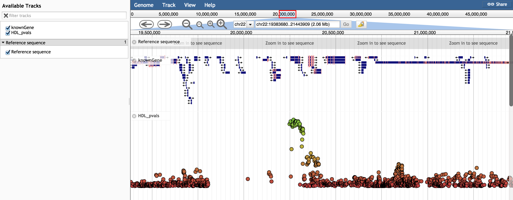

# gwasviewer

A JBrowse plugin that adds some custom glyphs for variants and GWAS data

## Options

* heightScaler - Numerical value to collapse or exapand y-axis. By default 1px is 1 unit in -log10(pvalue) units, so making heightScaler: 2 makes smaller -log10(pvalue) scores more visible
* maxHeight - Numerical value to set track height. Default: 210px
* showLabels - False by default
* useMyVariantInfo - Clicking on variant launches myvariant.info popup. Default: false
* useYAxis - Shows a y-axis bar. Default: true
* style->color - A color callback for the variables
* style->label - A string or callback for the feature label.
* scoreFun - A function to give the score for the graph. Default: "function(feature) { Math.log(feature.get('score')) }", can define similar in config file

Note for style->label: Can be useful to only show labels above a certain score, e.g. 

    "style": {
        "label": "function(feature) { return -Math.log(feature.get('score'))>50 ? feature.get('name') : null; }"
    }

## Example configuration

Using the "BEDTabix" class

      {
         "maxFeatureScreenDensity": 6,
         "storeClass" : "JBrowse/Store/SeqFeature/BEDTabix",
         "urlTemplate" : "HDL_pval_name.sort.bed.gz",
         "label" : "HDL_pvals",
         "type" : "GWASViewer/View/Track/VariantPlotter"
      }

Using a track loaded with flatfile-to-json.pl (flatfile-to-json.pl can load gff or bed with a score column)

      {
         "maxFeatureScreenDensity": 6,
         "storeClass" : "JBrowse/Store/SeqFeature/NCList",
         "urlTemplate" : "tracks/HDL_pval_name/{refseq}/trackData.json",
         "label" : "HDL_pvals",
         "type" : "GWASViewer/View/Track/VariantPlotter"
      }

## Screenshot

## Install

- Clone repo into plugins folder in JBrowse and name folder GWASViewer
- Add "plugins": ["GWASViewer"] to trackList.json or jbrowse_conf.json

Still in beta! Feel free to provide feedback
