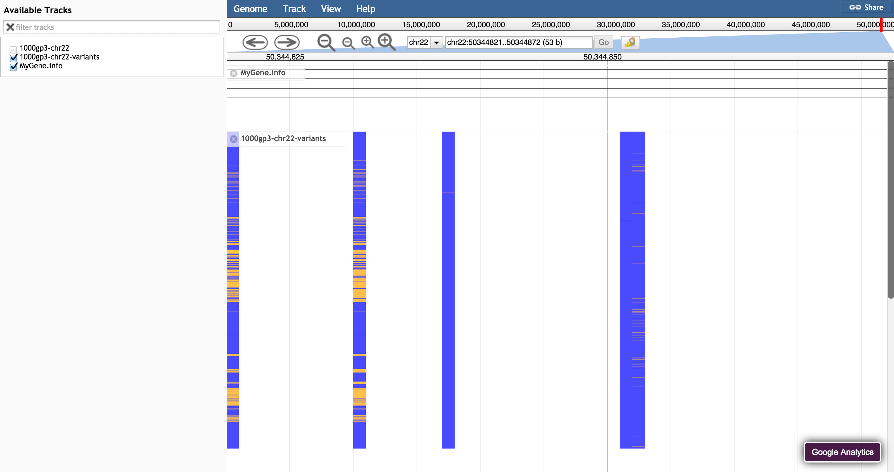

# variantviewer

A JBrowse plugin that adds some custom glyphs for variants

## Example configuration

    {
        "type": "VariantViewer/View/Track/VariantViewer",
        "urlTemplate": "variants.vcf.gz",
        "label": "Variant track",
        "storeClass": "JBrowse/Store/SeqFeature/VCFTabix",
        "style": {
            "height":1,
            "spacer":1,
            "color": "function(feat,gt,fullgt) { return gt=='ref'? 'blue': 'orange'; }"
        }
    }

## Options

* style->height - height of individuals
* style->spacer - (optional) offset between individuals, otherwise no spaces
* style->color - a color or a callback that colors every individual on the chart, which receives three arguments: the feature, a string that says 'ref' or 'alt', the actual genotype as 0|0 or 0|1 or similar. defaults to coloring 'ref' as green and 'alt' as red

Example: if spacer is 2 and height is 1 then there will be 1 px between each sample, but if height is 4 and spacer is 5 there will still be 1px between each sample

## Screenshot

