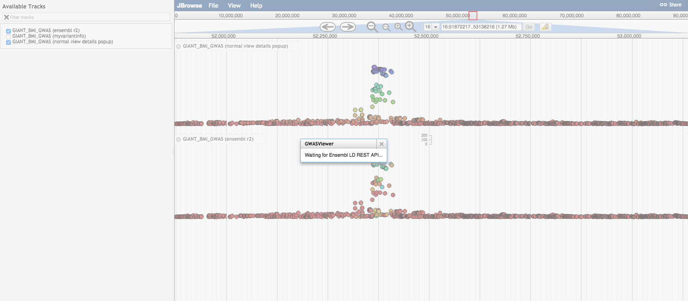

# gwasviewer

A JBrowse plugin that adds some custom glyphs for variants and GWAS data

## Options

* heightScaler - Numerical value to collapse or exapand y-axis. By default 1px is 1 unit in -log10(pvalue) units, so making heightScaler: 2 makes smaller -log10(pvalue) scores more visible
* maxHeight - Numerical value to set track height. Default: 210px
* showLabels - False by default
* scoreFun - A function to give the score for the graph. Default: "function(feature) { Math.log(feature.get('score')) }", can define similar in config file
* useYAxis - Shows a y-axis bar. Default: true
* style->color - A color callback for the variables
* style->label - A string or callback for the feature label.

## Fetch API options

* useMyVariantInfo - Clicking on variant launches myvariant.info popup. Default: false
* useMyVariantInfoURL - Default: 'https://myvariant.info/v1/query?q='
* useMyVariantInfoArgs - Default: '&fields=all'
* useEnsemblR2 - Clicking on a variant gets R^2 data from Ensembl REST API
* useEnsemblURL - Default: 'https://rest.ensembl.org/ld/human'
* useEnsemblArgs - Default: '?content-type=application/json;population_name=1000GENOMES:phase_3:KHV'

## Notes

* It could be useful to only show labels above a certain score for style->label, e.g. 

    "style": {
        "label": "function(feature) { return -Math.log(feature.get('score'))>50 ? feature.get('name') : null; }"
    }

* The circle glyph is used just for convenience, but it is by nature larger than the actual variant in genome coordinates on the screen, which can cause minor rendering issues like having half circles at block boundaries
* The useMyVariantInfo and useEnsemblR2 are exclusive to one another, as they both use click action

## Example configuration

Using the "BEDTabix" class

      {
         "maxFeatureScreenDensity": 6,
         "storeClass" : "JBrowse/Store/SeqFeature/BEDTabix",
         "urlTemplate" : "HDL_pval_name.sort.bed.gz",
         "label" : "HDL_pvals",
         "type" : "GWASViewer/View/Track/VariantPlotter"
      }

Using a track loaded with flatfile-to-json.pl (GWASViewer can load GFF file with scores, or a BED with a score column)

      {
         "maxFeatureScreenDensity": 6,
         "storeClass" : "JBrowse/Store/SeqFeature/NCList",
         "urlTemplate" : "tracks/HDL_pval_name/{refseq}/trackData.json",
         "label" : "HDL_pvals",
         "type" : "GWASViewer/View/Track/VariantPlotter"
      }

Note you can use flatfile-to-json.pl with --trackType "GWASViewer/View/Track/VariantPlotter" to automatically set this up

## Screenshot

Basic GWASViewer track

Shows track with `useEnsemblR2` enabled, which fetches R^2 from Ensembl for variants in linkage with a variant that is clicked (pink diamond)

## Install

- Clone repo into plugins folder in JBrowse and name folder GWASViewer
- Add "plugins": ["GWASViewer"] to trackList.json or jbrowse_conf.json

Still in beta! Feel free to provide feedback

## Test data

Test GWASViewer tracks are in the test/data/ directory, visit http://localhost/jbrowse/?data=plugins/GWASViewer/test/data or similar to view
